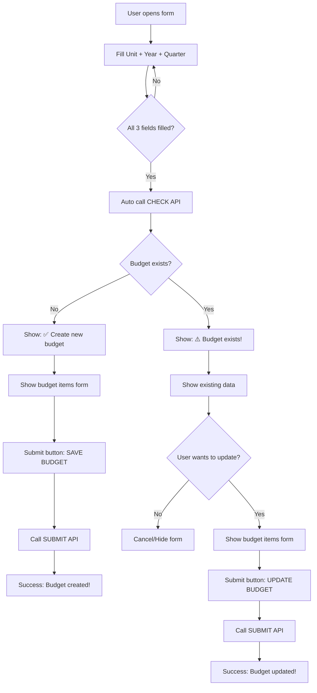

# Budget Form Flow - Visual Guide

## 🎯 **2 API Endpoints Explained**

| API | Purpose | When Used | Response |
|-----|---------|-----------|----------|
| `POST /api/budgets/check-existing` | Check if budget exists | Auto-trigger when form complete | `{ exists: boolean }` |
| `POST /api/budgets` | Save budget data | When user clicks submit | `{ message: "created/updated" }` |

## 📊 **Visual Flow Diagram**



## 🎮 **Interactive States**

### **State 1: Initial Form**
```
┌─── Budget Form ───┐
│ Unit:    [ ▼ ]    │
│ Year:    [ ▼ ]    │  
│ Quarter: [ ▼ ]    │
│                   │
│ [Hidden content]  │
└───────────────────┘
```

### **State 2: Checking...**
```
┌─── Budget Form ───┐
│ Unit:    Selected │
│ Year:    Selected │  
│ Quarter: Selected │
│                   │
│ 🔄 Checking...    │
└───────────────────┘
```

### **State 3A: New Budget**
```
┌─── Budget Form ───┐
│ Unit:    Selected │
│ Year:    Selected │  
│ Quarter: Selected │
│                   │
│ ✅ Ready to create│
│                   │
│ Budget Items:     │
│ ┌───────────────┐ │
│ │ [Form fields] │ │
│ └───────────────┘ │
│                   │
│ [💾 SAVE BUDGET] │
└───────────────────┘
```

### **State 3B: Existing Budget**
```
┌─── Budget Form ───┐
│ Unit:    Selected │
│ Year:    Selected │  
│ Quarter: Selected │
│                   │
│ ⚠️ Budget exists! │
│ • Item A: 500M    │
│ • Item B: 50M     │
│                   │
│ [🔄 Update] [❌]  │
└───────────────────┘
```

### **State 4: Update Mode**
```
┌─── Budget Form ───┐
│ Unit:    Selected │
│ Year:    Selected │  
│ Quarter: Selected │
│                   │
│ 🔄 Update mode    │
│                   │
│ New Budget Items: │
│ ┌───────────────┐ │
│ │ [Form fields] │ │
│ └───────────────┘ │
│                   │
│ [🔄 UPDATE]       │
└───────────────────┘
```

## 🔄 **API Call Sequence**

### **Scenario A: New Budget**
```
1. User fills form → Auto trigger
2. POST /api/budgets/check-existing
   └─ Response: { exists: false }
3. Show form with "SAVE BUDGET" button
4. User submits → POST /api/budgets
   └─ Response: { message: "Budget created successfully" }
```

### **Scenario B: Update Budget**
```
1. User fills form → Auto trigger  
2. POST /api/budgets/check-existing
   └─ Response: { exists: true, data: {...} }
3. Show warning with existing data
4. User confirms update
5. Show form with "UPDATE BUDGET" button
6. User submits → POST /api/budgets  
   └─ Response: { message: "Budget updated successfully" }
```

## 💻 **Frontend Implementation**

### **React Example**
```jsx
function BudgetForm() {
  const [state, setState] = useState('initial');
  const [existingBudget, setExistingBudget] = useState(null);
  
  // Auto-check when form is complete
  useEffect(() => {
    if (form.unit_id && form.budget_year_id && form.quarterly) {
      checkExisting();
    }
  }, [form.unit_id, form.budget_year_id, form.quarterly]);
  
  const checkExisting = async () => {
    setState('checking');
    const result = await api.checkExisting(form);
    
    if (result.exists) {
      setState('exists');
      setExistingBudget(result.data);
    } else {
      setState('new');
    }
  };
  
  const handleSubmit = async () => {
    const result = await api.submitBudget(form);
    
    if (state === 'new') {
      alert('Budget created successfully!');
    } else {
      alert('Budget updated successfully!');
    }
  };
  
  return (
    <div>
      {/* Form fields */}
      <select onChange={setUnitId}>...</select>
      <select onChange={setYearId}>...</select>
      <select onChange={setQuarterly}>...</select>
      
      {/* Dynamic content based on state */}
      {state === 'checking' && <div>🔄 Checking...</div>}
      
      {state === 'new' && (
        <div>
          <div>✅ Ready to create new budget</div>
          <BudgetItemsForm />
          <button onClick={handleSubmit}>💾 SAVE BUDGET</button>
        </div>
      )}
      
      {state === 'exists' && (
        <div>
          <div>⚠️ Budget already exists!</div>
          <ExistingBudgetList data={existingBudget} />
          <button onClick={() => setState('update')}>🔄 Update</button>
          <button onClick={() => setState('initial')}>❌ Cancel</button>
        </div>
      )}
      
      {state === 'update' && (
        <div>
          <div>🔄 Update mode</div>
          <BudgetItemsForm />
          <button onClick={handleSubmit}>🔄 UPDATE BUDGET</button>
        </div>
      )}
    </div>
  );
}
```

## ⭐ **Why This Design?**

### **Better UX**
- ✅ No surprises for users
- ✅ Clear feedback at each step  
- ✅ Confirmation before data loss
- ✅ Different actions for different scenarios

### **Cleaner Code**
- ✅ Separated concerns (check vs submit)
- ✅ Predictable state management
- ✅ Easier to test and debug
- ✅ Flexible for future features

### **Performance**
- ✅ Lightweight check API
- ✅ Heavy submit only when needed
- ✅ No unnecessary data transfer
- ✅ Faster user feedback

## 🎯 **Summary**

**2 APIs = 2 Different Jobs:**

1. **Check API** 👀 = "Does this budget exist?"
2. **Submit API** 💾 = "Save this budget data"

**1 Form = Multiple States:**

1. **Initial** → Fill basic info
2. **Checking** → Auto-validate  
3. **New/Exists** → Show appropriate UI
4. **Submit** → Save data

**Result = Smooth User Experience! 🚀**
